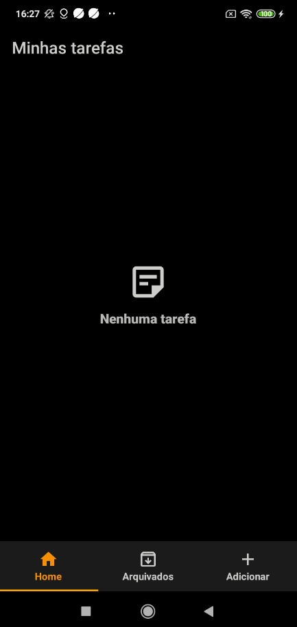
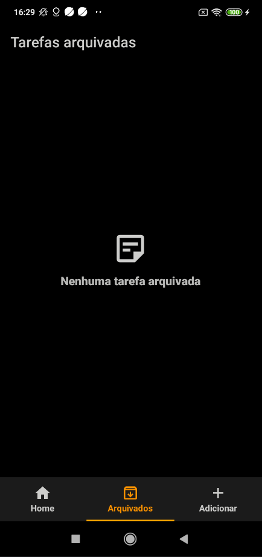
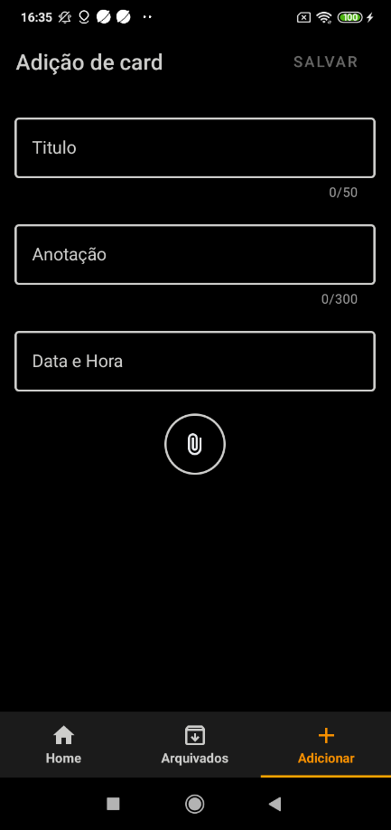
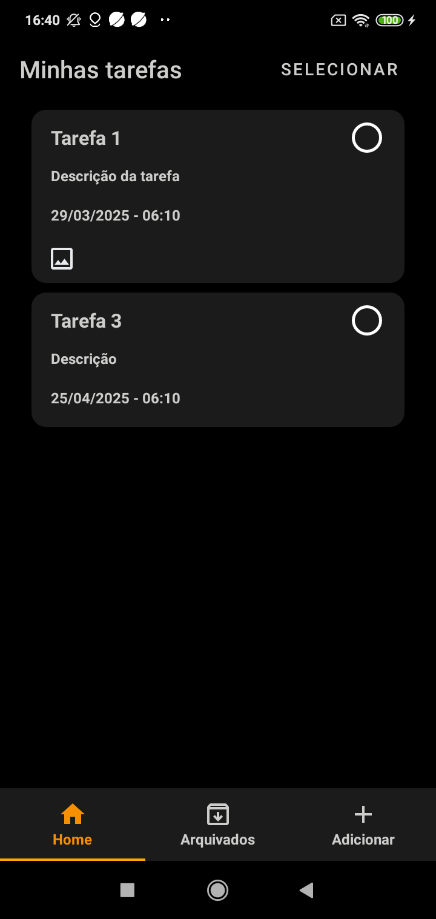
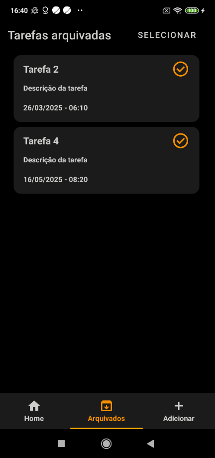

<h1 style="color: #bbbbb; text-align: center; font-family: Arial, sans-serif; font-weight: bold; border-bottom: 2px solid #f79000; padding-bottom: 10px;">
  StackNotes - Projeto
</h1>


<div style="background: #f5f5f5; border-left: 5px solid #f79000; padding: 10px 15px; border-radius: 8px;">

Projeto desenvolvido durante a vaga de jovem aprendiz programador back-end na Intelbras, onde o intuito é aprender como funciona a organização, raciocínio e conhecimento no desenvolvimento android.


## Objetivos


- Aprender a desenvolver um aplicativo utilizando **Kotlin**  
- Salvar dados em um banco de dados local usando o [Room](https://developer.android.com/training/data-storage/room)  
- Utilizar a [Arquitetura MVVM](https://learn.microsoft.com/pt-br/dotnet/architecture/maui/mvvm) para melhor organização do código  

### Tela Inicial
- Listar as tarefas com título, descrição, data (opcional) e anexo de imagem (opcional)  
- Adicionar navegação entre telas com [ViewPager2](https://developer.android.com/guide/navigation/navigation-swipe-view-2)  

### Tela de Arquivadas
- Exibir as tarefas que foram movidas para Arquivadas  
- Manter as informações da tela inicial  

### Tela de Adicionar
- Adicionar tarefas com título e descrição obrigatórios  
- Incluir anexos e data/hora como opcionais  

### Diferenciais
- Programação assíncrona com RxKotlin  
- RecyclerViews e dialogs personalizadas  
- *DatePicker* e *TimePicker* nativos do Android  
- Organização de tarefas por data e horário  
- Uso do **Material 3** para componentes  


## O App


Este projeto foi iniciado com o template *Empty Activity* e criado do zero. O aplicativo é dividido em três abas: **Home, Arquivadas e Adicionar**.  
Cada uma dessas abas possui um *Fragment* responsável pela lógica da tela.

A *Activity* e cada *Fragment* possuem seus próprios layouts. Além disso, existem layouts específicos para a listagem de tarefas, utilizados pelas *RecyclerViews*.  

### Funcionalidades

- O app inicia na tela de **Home**, onde as tarefas são listadas.  
- Se não houver nenhuma tarefa no banco de dados local, será exibida uma mensagem indicando que não há tarefas.  
- Se houver tarefas, elas serão exibidas na tela.  

#### 📌 Ações na Tela Home  
- O usuário pode **apagar ou arquivar** uma tarefa clicando no *card* ou no botão *check*, que exibirá uma *dialog* de confirmação.  
- Outra opção é clicar no botão **Selecionar**, exibindo uma *Snackbar* para escolher múltiplas tarefas e definir uma ação em grupo.  

#### 📌 Tela de Arquivadas  
- O usuário pode acessar essa tela por meio de um **swipe lateral**.  
- Exibe todas as tarefas arquivadas. Caso não haja nenhuma, uma mensagem será mostrada informando que não há tarefas arquivadas.  
- O usuário pode **desarquivar ou apagar** tarefas da mesma forma que na tela Home.  

#### 📌 Tela de Adicionar  
- O usuário pode acessar essa tela por meio de um **swipe lateral**.  
- Nessa tela, é possível adicionar uma nova tarefa com os seguintes campos:  
  - **Título** (mínimo de 1 e máximo de 50 caracteres)  
  - **Descrição** (mínimo de 1 e máximo de 300 caracteres)  
  - **Data e hora** (opcional)  
  - **Anexo de imagem** (opcional)  

- Para salvar a tarefa, basta clicar no botão **Salvar**, retornando para a tela *Home* com a nova tarefa já listada.  

#### 📌 Acessando Anexos  
- Se uma tarefa possui um anexo, será exibido um **ícone de imagem** na tela Home.  
- Ao clicar nesse ícone, a imagem anexada será exibida.  


### Visual do Aplicativo

<div style="display: flex; justify-content: center; gap: 10px; flex-wrap: wrap;">
  <div style="border: 3px solid #ddd; padding: 10px; border-radius: 10px; background: #f9f9f9; box-shadow: 2px 2px 10px rgba(0,0,0,0.1);">
    
  </div>
  <div style="border: 3px solid #ddd; padding: 10px; border-radius: 10px; background: #f9f9f9; box-shadow: 2px 2px 10px rgba(0,0,0,0.1);">
    
  </div>
  <div style="border: 3px solid #ddd; padding: 10px; border-radius: 10px; background: #f9f9f9; box-shadow: 2px 2px 10px rgba(0,0,0,0.1);">
    
  </div>
  <div style="border: 3px solid #ddd; padding: 10px; border-radius: 10px; background: #f9f9f9; box-shadow: 2px 2px 10px rgba(0,0,0,0.1);">
    
  </div>
  <div style="border: 3px solid #ddd; padding: 10px; border-radius: 10px; background: #f9f9f9; box-shadow: 2px 2px 10px rgba(0,0,0,0.1);">
    
  </div>
</div>


### Demonstração em Vídeo
Para ver o aplicativo em funcionamento, assista ao vídeo clicando clique [aqui](./assets/demo.mp4) para assistir.


## Instalação

Para utilizar e testar, basta clonar o repositório ou instalar o apk:

```
git clone https://github.com/christianalexandre/PJA.git
```

* <a href="./app/build/outputs/apk/debug" download="app-debug.apk">APK</a>


## Dificuldades

* Utilização do Material 3 com compatibilidade com algumas versões android
* Utilização do RxKotlin
* Estado de uma tarefa com relação a componentes e banco de dados
* Otimização do aplicativo

## Melhorias necessárias

* Correções de bugs visuais
* Correção de bugs com relação ao botão de selecionar tarefas
* Selecionar tarefa ao pressionar

## Construído com

* [Android Studio](https://developer.android.com/studio) - IDE
* [Kotlin](https://kotlinlang.org/) - Linguagem
* [Room](https://developer.android.com/training/data-storage/room) - Banco de dados local
* [Material 3](https://m3.material.io/develop/android/jetpack-compose) - Banco de dados local

## Autor

* **João Vitor Castilhos da Silveira** - [Linkedin](https://www.linkedin.com/in/jo%C3%A3o-vitor-castilhos-da-silveira/)
</div>